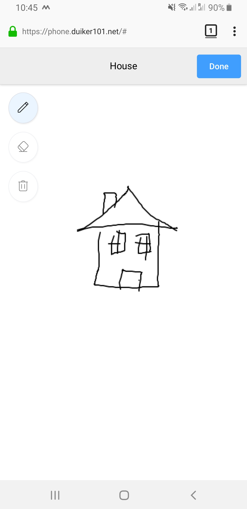

# PictoPhone
> The old age Telephone game. But with pictures. On your phone.

When you were young you probably played the game of Telephone where a word gets passed from person to person and ends up distorted usually.
A friend recently introduced me to a version where you draw the word instead of just saying it. But since you need paper you usually can't play it when you actually need it.
Therefore I spent some time to create a web version that anyone can use to play! 

## Rules of the game

The game is simple:
* Get everyone in a circle
* Every player a phone and sets the same number of passes.
* Press start and choose a starting word.
* Pass the phone to the next person in the circle
* Draw the word that you see and press Done
* Pass the phone to the next person in the circle
* Guess what the previous person drew 
* Pass the phone
* ....
* Once the number of passes has been completed you will see the total progression and can even save it!

## Meta

 [@Duiker101](https://twitter.com/duiker101)

Distributed under the XYZ license. See ``LICENSE`` for more information.

[https://github.com/yourname/github-link](https://github.com/dbader/)

## Contributing

1. Fork it (<https://github.com/duiker101/pictophone/fork>)
2. Create your feature branch (`git checkout -b feature/fooBar`)
3. Commit your changes (`git commit -am 'Add some fooBar'`)
4. Push to the branch (`git push origin feature/fooBar`)
5. Create a new Pull Request

